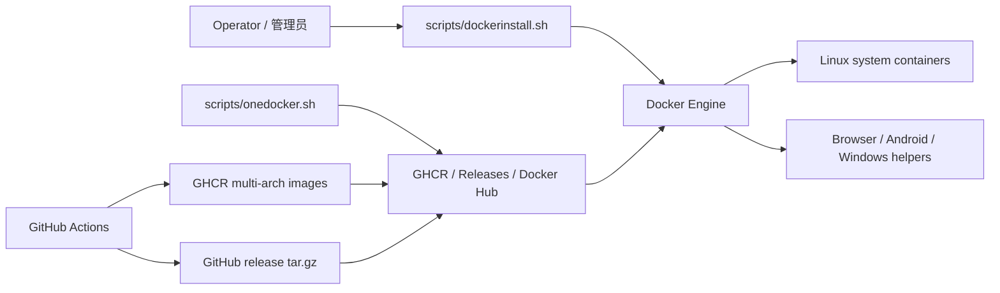

# docker

[](https://hits.spiritlhl.net)

## 更新

2026.06.04

- 统一无交互执行方式为 `export noninteractive=true`
- 补充 CI 约束、环境变量、架构说明和安全忽略规则
- 修复容器创建、卸载重装、镜像回退和 Guacamole 数据库初始化边界问题
- 修复 Windows 辅助启动失败误报成功、Release 分片上传凭据硬编码和关键远程脚本下载校验等边界

[更新日志](CHANGELOG.md)

## 说明文档

国内(China)：

[https://virt.spiritlhl.net/](https://virt.spiritlhl.net/)

国际(Global)：

[https://www.spiritlhl.net/en/](https://www.spiritlhl.net/en/)

说明文档中 Docker 分区内容

## 说明

- 支持系统：Ubuntu、Debian、Alpine、AlmaLinux 9、RockyLinux 9、OpenEuler 22.03
- 系统输入支持带版本号写法，例如 `debian11`、`debian/11`、`ubuntu20`、`almalinux9`、`rockylinux9`、`openeuler22.03`；脚本会归一到当前维护的镜像族
- 支持架构：amd64、arm64
- 镜像同时发布到 GHCR（`ghcr.io/oneclickvirt/docker`）和 GitHub Releases（tar.gz 离线包）
- `onedocker.sh` 优先从 GHCR 拉取镜像，失败后自动回退至 Releases 离线包，最后回退到 Docker Hub

## 快速开始 / Quick Start

1. 使用 root 用户登录一台支持 Docker 的 Linux 主机。
2. 执行 `export noninteractive=true`，让脚本统一走无需交互模式。
3. 运行 Docker 环境安装脚本。
4. 运行 `onedocker.sh` 或 `create_docker.sh` 创建容器。
5. 用脚本输出的 SSH 端口或 Web 地址访问服务。

## 架构



## 安装 Docker 环境

```bash
export noninteractive=true
bash <(wget -qO- https://raw.githubusercontent.com/oneclickvirt/docker/main/scripts/dockerinstall.sh)
```

如需交互式安装，不设置 `noninteractive` 即可。

## 常用环境变量

| 变量 | 默认值 | 说明 |
|------|--------|------|
| `noninteractive` | 空 | 设为 `true` 时跳过脚本交互提示，统一使用默认值或已传入变量 |
| `WITHOUTCDN` | `false` | 设为 `TRUE` 时禁用 CDN 加速地址探测 |
| `CN` | 自动检测 | `true` 强制使用中国镜像源，`false` 跳过中国 IP 检测 |
| `IPV6_MAXIMUM_SUBSET` | `n` | 是否在 SLAAC 场景使用 IPv6 最大子网范围 |
| `NEED_DISK_LIMIT` | `n` | 是否启用 btrfs 容器磁盘限制 |
| `DOCKER_INSTALL_PATH` | `/var/lib/docker` | Docker 数据目录 |
| `DOCKER_POOL_SIZE` | `20` | btrfs 存储池大小，单位 GB |
| `DOCKER_LOOP_FILE` | `/opt/docker-pool.img` | btrfs loop 文件路径 |
| `DOCKER_CREATE_COUNT` | `1` | 批量创建 Linux 容器数量 |
| `DOCKER_MEMORY_MB` | `512` | 批量创建时每个容器内存，单位 MB |
| `DOCKER_CPU` | `1` | 批量创建时每个容器 CPU 核数 |
| `DOCKER_DISK_GB` | `0` | 批量创建时每个容器磁盘限制，`0` 表示不限 |
| `DOCKER_SYSTEM` | `debian` | 批量创建默认系统，支持 `debian11`、`debian/11`、`ubuntu20` 等带版本号写法并归一到当前维护的镜像族 |
| `DOCKER_INDEPENDENT_IPV6` | `n` | 批量创建时是否附加独立 IPv6 |
| `ANDROID_RESET_DATA` | 空 | 设为 `true` 时重建 Android 容器前清空 `/root/android/data`，默认保留并复用旧数据 |
| `ANDROID_WEB_USER` / `ANDROID_WEB_PASSWORD` | `onea` / `oneclick` | Android Web 认证默认用户名和密码 |
| `CHROMIUM_USER` / `CHROMIUM_PASSWORD` | `oneclick` / `oneclick` | Chromium Web 登录信息 |
| `CHROMIUM_HTTP_PORT` / `CHROMIUM_HTTPS_PORT` | `3004` / `3005` | Chromium Web 端口 |
| `CHROMIUM_SHM_GB` | `2` | Chromium 共享内存大小，单位 GB |
| `FIREFOX_PASSWORD` | `oneclick` | Firefox Web/VNC 默认密码 |
| `FIREFOX_WEB_PORT` / `FIREFOX_VNC_PORT` | `3003` / 空 | Firefox Web/VNC 端口 |
| `FIREFOX_SHM_GB` | `2` | Firefox 共享内存大小，单位 GB |
| `WEBTOP_USER` / `WEBTOP_PASSWORD` | `onew` / `oneclick` | Webtop 登录信息 |
| `WEBTOP_HTTP_PORT` / `WEBTOP_HTTPS_PORT` | `3004` / `3005` | Webtop Web 端口 |
| `WEBTOP_SHM_GB` | `2` | Webtop 共享内存大小，单位 GB |
| `GUACAMOLE_DB_NAME` / `GUACAMOLE_DB_USER` | `guacdb` / `guacadmin` | Guacamole MySQL 数据库名和应用用户 |
| `GUACAMOLE_MYSQL_ROOT_PASSWORD` / `GUACAMOLE_MYSQL_PASSWORD` | `password` / `password` | Guacamole MySQL root 密码和应用用户密码 |
| `GUACAMOLE_PORT` / `GUACAMOLE_NETWORK` | `80` / `guacamole_net` | Guacamole Web 端口和 Docker 内部网络 |
| `GITHUB_TOKEN` / `TOKEN` | 空 | `extra_scripts/splitandupload.sh` 上传 Release 分片时使用的 GitHub Token |

## 安全提示

- 默认密码只适合快速验证；生产或公网环境请通过参数或环境变量显式设置高强度密码。
- `.gitignore` 已排除 `.env`、数据库、密码/密钥、日志、截图和镜像归档产物，避免把敏感数据或构建产物提交到仓库。
- 卸载脚本会清理容器、镜像、网络、systemd 服务和 Docker 二进制文件，交互模式下必须输入 `yes`，无交互模式请先确认目标主机可被完整清理。

## 开设单个容器

```bash
# 用法: ./onedocker.sh <name> <cpu> <memory_mb> <password> <sshport> <startport> <endport> [independent_ipv6:y/n] [system] [disk_gb]
bash onedocker.sh dc1 1 512 mypasswd 25001 35001 35025 n debian 0
```

## 批量开设容器

```bash
bash create_docker.sh
```

## 查看与管理容器

```bash
# 查看所有容器
docker ps -a
# 查看日志文件
cat /root/dclog
# 在容器内执行命令
docker exec <name> bash -lc 'systemctl status ssh || true'
```

## 卸载（完整清理）

一键卸载 Docker 全套环境，包括所有容器、镜像、网络、systemd 服务、二进制文件：

```bash
export noninteractive=true
bash <(wget -qO- https://raw.githubusercontent.com/oneclickvirt/docker/main/dockeruninstall.sh)
```

未设置 `noninteractive=true` 时，脚本会在执行前要求输入 `yes` 确认，操作不可逆。

> **复测流程**：先执行卸载，再执行安装，即可从零验证整个安装流程。

## 镜像说明

本仓库自编镜像通过 GitHub Actions 构建，同时发布到 GHCR 和 GitHub Releases：

| 系统 | GHCR 镜像（多架构）| amd64 tar | arm64 tar |
|------|---------------------|-----------|-----------|
| Ubuntu | `ghcr.io/oneclickvirt/docker:ubuntu` | spiritlhl_ubuntu_amd64.tar.gz | spiritlhl_ubuntu_arm64.tar.gz |
| Debian | `ghcr.io/oneclickvirt/docker:debian` | spiritlhl_debian_amd64.tar.gz | spiritlhl_debian_arm64.tar.gz |
| Alpine | `ghcr.io/oneclickvirt/docker:alpine` | spiritlhl_alpine_amd64.tar.gz | spiritlhl_alpine_arm64.tar.gz |
| AlmaLinux 9 | `ghcr.io/oneclickvirt/docker:almalinux` | spiritlhl_almalinux_amd64.tar.gz | spiritlhl_almalinux_arm64.tar.gz |
| RockyLinux 9 | `ghcr.io/oneclickvirt/docker:rockylinux` | spiritlhl_rockylinux_amd64.tar.gz | spiritlhl_rockylinux_arm64.tar.gz |
| OpenEuler 22.03 | `ghcr.io/oneclickvirt/docker:openeuler` | spiritlhl_openeuler_amd64.tar.gz | spiritlhl_openeuler_arm64.tar.gz |

手动拉取示例：

```bash
docker pull ghcr.io/oneclickvirt/docker:debian
```

## 网络说明

- 默认使用主机 NAT 网络，通过端口映射暴露 SSH 及自定义端口
- 若宿主机配置了公网 IPv6 并检测到 ndpresponder 容器，可为容器分配独立 IPv6 地址

## 致谢

感谢 [LinuxMirrors](https://github.com/SuperManito/LinuxMirrors) 提供的国内镜像安装以及国内包管理源镜像替换脚本

## Stargazers over time

[](https://starchart.cc/oneclickvirt/docker)
